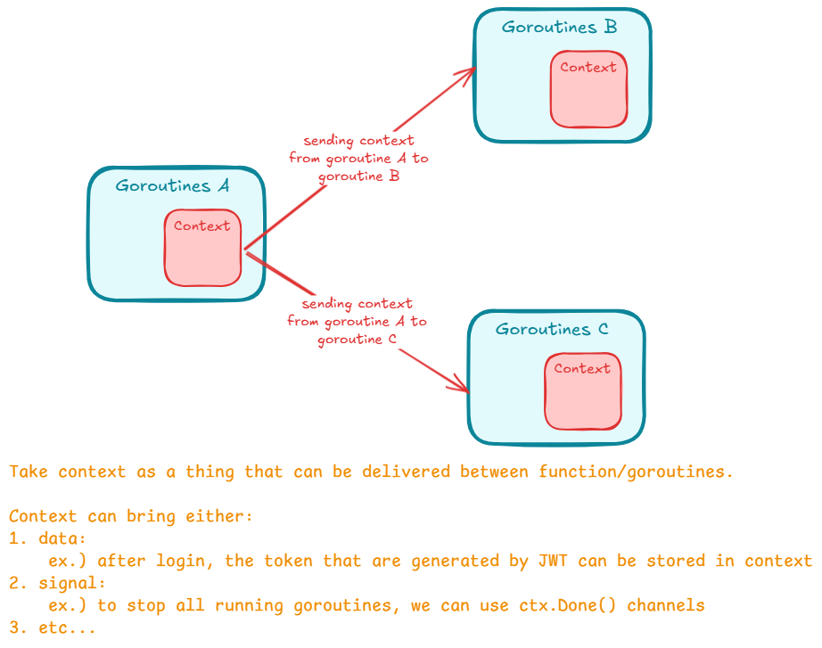
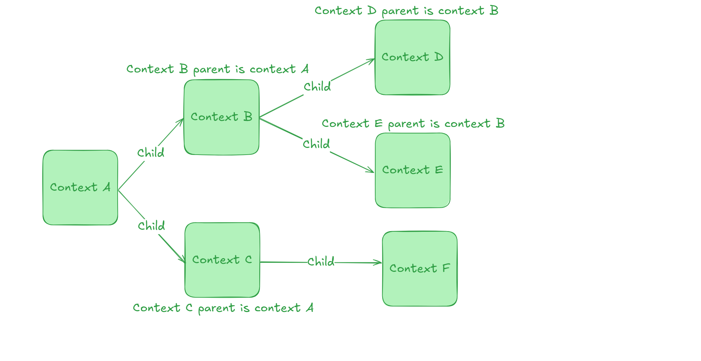

## Apa itu context?

- Context merupakan sebuah data yang isinya membawa value/signal untuk cancel, timeout, deadline dsbnya. Nah mksdnya apa?
- Context intinya dibuat per-request. Contoh, context dibuat ketika ada request masuk ke api. 1 request = 1 context.
- Context dibuat untuk mempermudah kita meneruskan value, dan sinyal antar proses. (Context bisa digunakan untuk mengirim value antar proses/sinyal untuk membatalkan seluruh Goroutine yang sedang berjalan).


## Kenapa Context digunakan?

- Intinya context digunakan untuk mengirimkan data dari 1 goroutine ke goroutine lain, atau memberi sinyal ke proses lain. (sinyal disini tuh kek sinyal pembatalan, timeout, deadline, dsbnya).
- Dengan menggunakan context, ketika kita ingin membatalkan semua proses, kita cukup mengirim sinyal ke context, maka secara otomatis semua proses akan dibatalkan.
- Hampir semua bagian di Golang memanfaatkan context, seperti database, http server, http client, dsbnya.
- Context wajib digunakan dan selalu dikirim ke setiap function yang dikirim. (Di Google sendiri ketika membuat function itu pasti ada parameter context buat memastikan bahwa sebuah function bisa dibatalkan di tengah-tengah perjalanan).


## Cara kerja context




## Package Context

- Context direpresentasikan di dalam sebuah interface Context.
- Interface Context terdapat dalam package context.
- Jadi kita sebagai Golang Developer bisa tinggal pakai aja si fitur Context ini.
  
Bentuknya:
```go
type Context interface {
	// 1. setting
	Deadline() (deadline time.Time, ok bool)
	
	// 2. channel Done() kek yang biasanya dipakai di kafka pada class consumer, jadi kalau dia mengembalikan value maka context itu berhenti/dibatalkan. 
	Done() <-chan struct{}
	
	// 3. ini kalau error, context bisa ngasih tau error
	Err() error
	
	// 4. context juga bisa nerima value dan store di dalam context tersebut (mirip kayak session/local storage, context itu bawa" info/data juga)
	Value(key interface{}) interface{}
}
```


## Membuat Context

- Karena Context adalah sebuah interface, untuk membuat context kita butuh sebuah struct yang sesuai dengan kontrak interface Context.
- Namun kita tidak perlu membuatnya secara manual.
- Di Golang, terdapat package context yang punya function yang bisa digunakan untuk membuat context.


## Function membuat Context

| Function | Keterangan                                                                                                                                                                                                  |
| :--- |:------------------------------------------------------------------------------------------------------------------------------------------------------------------------------------------------------------|
| `context.Background()` | Membuat context kosong. Tidak pernah dibatalkan, tidak pernah timeout, dan tidak memiliki value apapun. Biasanya digunakan di main function atau dalam test, atau dalam **awal proses request terjadi**.    |
| `context.TODO()` | Membuat context kosong seperti Background(), namun biasanya menggunakan ini ketika belum jelas context apa yang ingin digunakan. Tapi overall gaada bedanya sama `.Background()` dan jarang banget dipakai. |

Intinya di awal kita selalu inisialisasi `context.Background()` ketika sebuah request dibuat. Dan **context ini biasa digunakan di layer handler**.  
Contoh:
```go
func (h *UserHandlerImpl) Create(c *gin.Context) {
	// step 1: ambil request dari body
	var request request.CreateUserRequest
	err := c.ShouldBindJSON(&request)
	if err != nil {
		c.JSON(http.StatusBadRequest, gin.H{
			"code":    http.StatusBadRequest,
			"message": "Invalid request",
		})
		return
	}

	// step 2: buat context buat ngatur time-out (handle connection time-out)
	ctx, cancel := context.WithTimeout(c.Request.Context(), 5*time.Second)
	defer cancel()

	// step 3: call service-nya buat create task-nya
	response, err := h.UserService.Create(ctx, request)
	if err != nil {
		c.JSON(http.StatusInternalServerError, gin.H{
			"code":    http.StatusInternalServerError,
			"message": err.Error(),
		})
		return
	} else {
		c.JSON(http.StatusOK, gin.H{
			"code":    http.StatusOK,
			"message": "User created successfully",
			"data":    response,
		})
		return
	}
}
```
  
atau  

```go
func (h *UserHandlerImpl) FindByEmail(c *gin.Context) {
	// step 1: ambil email dari params
	email := c.Query("email")
	
	if email == "" {
		c.JSON(http.StatusBadRequest, gin.H{
			"code":    http.StatusBadRequest,
			"message": "Email is required",
		})
		return
	}

	// step 2: buat context buat ngatur time-out (handle connection time-out)
	ctx, cancel := context.WithTimeout(c.Request.Context(), 5*time.Second)
	defer cancel()

	// step 3: call service-nya buat find user-nya
	response, err := h.UserService.FindByEmail(ctx, email)
	if err != nil {
		c.JSON(http.StatusInternalServerError, gin.H{
			"code":    http.StatusInternalServerError,
			"message": "Failed to find user with this email",
		})
		return
	} else {
		c.JSON(http.StatusOK, gin.H{
			"code":    http.StatusOK,
			"message": "User found successfully",
			"data":    response,
		})
		return
	}
}
```

Dimana context yang dibuat di handler ini pasti diteruskan dan dibawa ke setiap function (service/usecase layer) terlepas digunakan atau tidak nantinya. Tapi biasanya digunakan dalam membawa JWT Token/Session dari user meskipun ini bukan best practices karena membuat aplikasi kita menjadi stateful aplikasi bukan stateless.
  
[Code](01-create-context.go)


## Kenapa ga pakai context.TODO()?

Karena berbeda dengan `context.Background()` yang sudah memiliki fitur seperti channel `.Done()`, Value, dsbnya. Context TODO itu literally context kosong tanpa fitur apapun, makanya sangat jarang kita menggunakan context.TODO() dalam project.


## Parent dan Child Context

- Context menganut konsep parent dan child jadi ada konsep inheritance/pewarisan.
- Artinya, saat kita membuat context, kita bisa membuat child context dari context yang sudah ada.
- Parent context bisa memiliki banyak child, namun child hanya bisa memiliki satu parent context (tipikal inheritance problem di Java).




## Hubungan antara parent dan child context

- Parent dan child akan selalu terhubung.
- Jadi ketika kita melakukan pembatalan context A, maka semua child dan sub-child dari context A juga akan ikut terbatalkan.
- Namun, jika child yang dibatalkan seperti context B, maka hanya child dan sub-child dari context B, tapi context A yang merupakan parent tidak akan di cancel.
- Begitu juga saat kita menyisipkan data ke dalam context A, semua child dan sub child dari context A bisa mendapatkan data tersebut. Inilah yang menunjukkan kegunaan context dalam membawa data seperti token/session dalam stateful application.
- Namun, jika kita menyisipkan data ke dalam context B, context A tidak akan mendapatkan datanya (parent ga dapet).


## Immutable (Read-only)

- Context itu data-nya immutable, artinya ketika context telah dibuat, maka dia tidak bisa diubah lagi (valuenya tidak bisa diubah).
- Ketika kita menambahkan value ke dalam context, atau menambahkan pengaturan timeout dsbnya, secara otomatis akan membentuk child context baru, bukan mengubah context tersebut.
- Contoh, context B punya value nama yaitu "Eko", nah ketika kita ubah value tersebut jadi "Budi", bukan context B yang berubah valuenya tapi justru membuat child context yaitu context C.


## Context With Value

- Pada saat awal membuat context, context tidak memiliki value baik itu kita buat `context.Background()` apalagi `context.TODO()`
- Kita bisa menambahkan value pada context dengan format data **`Pair (key-value)`**.
- Saat kita menambahkan value ke context, secara otomatis akan tercipta child context baru, artinya original context sebenarnya tidak berubah sama sekali.
- Untuk membuat menambahkan value ke context, kita bisa menggunakan function `context.WithValue(parent, key, value)`.

Contoh use-cases-nya di middleware dimana beberapa informasi kita pass ke dalam context:
```go
// code above are process of validating and generating a JWT token...

// step 1: create the parent context (in this case, we are using (*gin.Context)
ctx := c.Request.Context() // this is the parent context

// step 2: create a value that store username and userId. (basically we create one child and one sub-child context)
if parsedClaims.User != nil {
	ctx = context.WithValue(ctx, "username", parsedClaims.User.Name) // let's say this's context B
	if parsedClaims.User.ID != 0 {
		ctx = context.WithValue(ctx, "userId", parsedClaims.User.ID) // let's say this's context C
    } else {
		// error handling...
    }
} else {
	// error handling...
}

// step 3: Ganti context yang digunakan oleh *http.Request dengan context baru (ctx) hasil chain dari context.WithValue.
c.Request = c.Request.WithContext(ctx)

// continue...

/*
    Explanations:
        Context A (dari Request awal)
        │
        └───(WithValue: username=X)───> Context B
                                        │
                                        └───(WithValue: userId=Y)───> Context C
                                                                         ▲
                                                                         │
                                                         Request baru pakai Context C (step 3 happens here)
 */
```


## Context Get Value

- Gimana cara kita bisa pakai value dari context yang sudah di set tersebut?
- Pakai method `.Value(key)`
- Gimana cara kerjanya? ketika kita menggunakan `.Value()`, dia akan mencari key tersebut dari dirinya sendiri terlebih dahulu, oh kalau ternyata beda key, baru dia akan naik ke parent-nya (oh kalau ternyata beda key juga, dia akan naik lagi, dstnya sampai dapat).
- Maka sangat dianjurkan untuk setiap orang tua memiliki child satu saja biar ga pusing :)


## Context With Cancel

- Selain menambahkan value ke dalam context, kita juga bisa menambahkan sinyal cancel ke Context.
- Kapan sinyal cancel diperlukan dalam context?
- Contoh ketika kita butuh menjalankan proses lain, dan kita ingin memberi sinyal cancel ke proses tersebut.
- Biasanya proses ini berupa goroutine yang berbeda, sehingga dengan mudah jika kita ingin membatalkan eksekusi goroutine, kita bisa mengirim sinyal cancel ke contextnya.
- Namun ingat goroutine yang menggunakan context, tetap harus melakukan pengecekan terhadap contextnya, jika tidak, tidak ada gunanya. (Pakai parameter context tapi ga pernah dipake).
- Untuk membuat context dengan cancel signal, kita bisa menggunakan function `context.WithCancel(parent)`.


## Goroutine Leak (Goroutine yang jalan terus dan tidak bisa berhenti)

[Code](03-cancel-signal)

Nah, ini yang ngejelasin kenapa kita ngejalanin Consumer di Kafka itu pakai ctx.Done() juga yang bakal return value once Cancel() are triggered. Cancel() sendiri ada dari Context.WithCancel(parent) yang basically return 2 value yaitu child context yang mana akan return sebuah value pada ctx.Done() once cancel() triggered yang juga di return oleh fucntion WithCancel(parent) yang sama.
Intinya coba pahamin Consumer.go di Kafka udah gitu balik lagi baca yang ini. It will all make senses.
```go
parent := context.Background()

// create a context with cancel
ctx, cancelFunc := context.WithCancel(parent)

// ctx here will be passed into the function that have a running goroutines that may leaked.
// why? because ctx here have a channel which is ctx.Done() that will return a value, triggering a stop on a running goroutine.
// ctx.Done() only returns a value when cancelFunc() are called...
```


## Context With Timeout

- Kita bisa menambahkan sinyal cancel ke Context secara otomatis (kalau yang WithCancel() tadi itu manual).
- Ini kepakai kek waktu kita query ke database terus kalau responsenya memakan waktu lebih dari 5 detik, kita bisa melakukan cancel() terhadap process yang sedang berjalan.
- Cocok dipakai untuk case misal database lagi down, nah instead of making the request infinitely, we can stop the process by giving a time limit.
- Intinya ini time limit buat ngebatesin berapa lama sebuah process berjalan.
- Cara pakenya literally `context.WithTimeout(parent, duration)`
- Biasanya kita pake khusus untuk `WithCancel()` dan `WithTimeout()` itu kadang kek gini:
  - `ctx, cancel := context.WithCancel(ctx.Background())`
  - `ctx, cancel := context.WithTimeout(ctx.Background(), 5 * time.Second)`
- Nah, khusus untuk Context With Timeout, untuk apa cancel functionnya? nah bisa aja hasilnya keluar lebih cepat daripada time limitnya, kita tetap harus menjalankan cancel function tersebut.
- Biasa, khusus untuk Timeout, kita pakai `defer cancel()` buat otomatis jalanin cancelnya begitu processnya selesai.

Contoh code:
```go
func CreateCounter(ctx context.Context) chan int {
	destination := make(chan int)
	go func() {
	    defer close(destination)
		counter := 1
		for {
			select {
			case <- ctx.Done()
			    return
			default:
				destination <- counter
				counter++
				time.Sleep(1 * time.Second) // simulate a slow process
            }   
        }   
    }
	return destination
}

func main() {
    // check how many goroutines are running before and after CreateCounter()
    fmt.Println("Total Goroutine: ", runtime.NumGoroutine())
    
    // Initiate context here
	ctx, cancel := context.WithTimeout(context.Background(), 5 * time.Second) // The cancel function here, if it's called, it will make ctx.Done() return a value making the goroutines stop
    defer cancel() // still need to be called to makesure if the function are finished under the time limit we set earlier, stop the goroutines
    
	// Run the goroutine
    destination := CreateCounter(ctx)
	
    // Check how many value are in the channel
    for n := range destination {
        fmt.Println("Counter: ", n)
        if n == 10 {
            break
        }
    }
    
    // check how many goroutines are running before and after CreateCounter()
    fmt.Println("Total Goroutine: ", runtime.NumGoroutine())
}
```


## Context With Deadline

- Selain menggunakan timeout untuk melakukan cancel otomatis, kita juga bisa menggunakan deadline.
- Pengaturan deadline sedikit berbeda dengan timeout, jika timeout kita beri waktu dari sekarang, kalo deadline ditentukan kapan waktu timeout nya, misal jam 12 siang hari ini
- Untuk membuat context dengan cancel signal secara otomatis menggunakan deadline, kita bisa menggunakan function `context.WithDeadline(parent, time)`
  - Contoh: `ctx, cancel := context.WithDeadline(parent, time.Now().Add(5 * time.Second))`