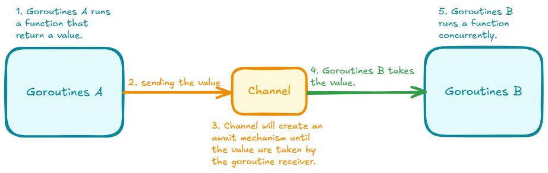

## Apa itu Channel?

- Tempat komunikasi secara synchronous yang bisa dilakukan oleh goroutine.
- Ini yang menjadi solusi ketika kita membutuhkan return value dari sebuah function yg dijalankan oleh goroutine.
- Kita tau function yang dipanggil dengan keyword `go`, value yang dikembalikan tidak bisa direturn.
- Di channel terdapat pengirim dan penerima, biasanya pengirim dan penerima adalah goroutine berbeda. Jadi ada goroutine pengirim value (function yg return valuenya) dan goroutine yang penerima value (goroutine yang menerima value yang direturn via channel).
- Saat melakukan pengiriman data ke Channel, goroutine akan ter-block (goroutine tidak akan jalan sampai data di dalam channel ada yang mengambilnya).
- Maka dari itu, Channel disebut sebagai alat komunikasi  yang syncrhonous.
- Channel ini cocok sebagai alternatif seperti async await. Dimana kali ini **async** dalam Golang itu adalah Goroutine dan **await** dalam Golang itu adalah Channel.




## Karakteristik Channel

- Secara default, channel hanya bisa menampung 1 data, tunggu sampai itu diambil, baru bisa menambah data lagi.
- Channel hanya bisa menerima satu jenis data (tentukan tipe data-nya).
- Channel bisa diambil dari lebih dari satu goroutine. (Pengirim bisa banyak tapi hanya 1 value yang bisa diterima pada saat yang bersamaan).
- Channel harus di close (best practices) jika tidak digunakan untuk menghindari memory leak.


## Cara membuat channel

- Channel di Golang direpresentasikan dengan tipe data Chan.
- Untuk membuat Channel terbilang sangat mudah, kita bisa tinggal menggunakan **`make()`**, mirip ketika membuat map.
- Namun saat pembuatan channel, kita harus tentukan tipe data apa yang bisa dimasukkan ke dalam channel tersebut.

```go
// contoh channel dengan tipe data string

channel := make(chan string)

// ...

close(channel)
```

## Mengirim dan Menerima Data dari Channel

- Channel bisa digunakan untuk mengirim dan menerima data.
- Untuk mengirim data, kita bisa menggunakan kode: **`channel <- data`**.
- Sedangkan untuk menerima data, kita bisa menggunakan kode: **`data <- channel`**.
- Setelah selesai, selalu close channel.


## Channel sebagai parameter

- Dalam kenyataan pembuatan aplikasi, seringnya kita akan mengirim channel ke function lain via parameter.
- Sebelumnya kita tau bahkan di Golang by default, parameter adalah pass by value, artinya value akan diduplikasi lalu dikirim ke function parameter, sehingga jika kita ingin mengirim data asli, kita biasa menggunakan pointer (pass by reference).
- Berbeda dengan channel, kita tidak perlu melakukan hal tersebut.

Contoh kode:
```go
func sendData(channel chan string, data string) {
	time.Sleep(1 * time.Second)
	channel <- data
}

func main() {
	// 1. create the channel (take this as a variable that will change it's value)
	channel := make(chan string)
	defer close(channel)

	// 2. send the data via goroutines
	go sendData(channel, "This's the data")

	// testing purposes
	fmt.Println("I'm runned before sendData()")

	// 4. receive the data
	random_variable := <-channel

	// testing purposes
	fmt.Println("I'm waiting the data received...")

	// 5. line below 25 will be runned after the data are received...
	fmt.Println(random_variable)
}
```

## Channel In and Out

- Saat kita mengirim channel sebagai parameter, isi function tersebut bisa mengirim dan menerima data dari channel tersebut.
- Lalu bagaimana cara kita memberi tahu terhadap function, bahwa channel tersebut hanya digunakan untuk mengirim data, atau hanya dapat digunakan untuk menerima data?
- Hal ini bisa kita lakukan di parameter dengan cara menandai apakah channel ini digunakan untuk in (mengirim data) atau out (menerima data).

Contoh code:

- Channel In (`channel chan<- string`)
```go
func SendData(channel chan<- string, data string) {
	channel <- data
}
```

- Channel Out (`channel <-chan string`)
```go
func ReceiveData(channel <-chan string, *data string) {
	data := channel
}
```

-  Usage Example:
```go
func SendData(channel chan<- string, data string) {
	time.Sleep(1 * time.Second)
	channel <- data
}

func ReceiveData(channel <-chan string, data string) {
	data = <-channel
	fmt.Println(data)
}

func main() {
	channel := make(chan string)
	defer close(channel)

	go SendData(channel, "Hello World")
	go ReceiveData(channel, "Hello World")

	time.Sleep(3 * time.Second)
}
```

## Buffered Channel